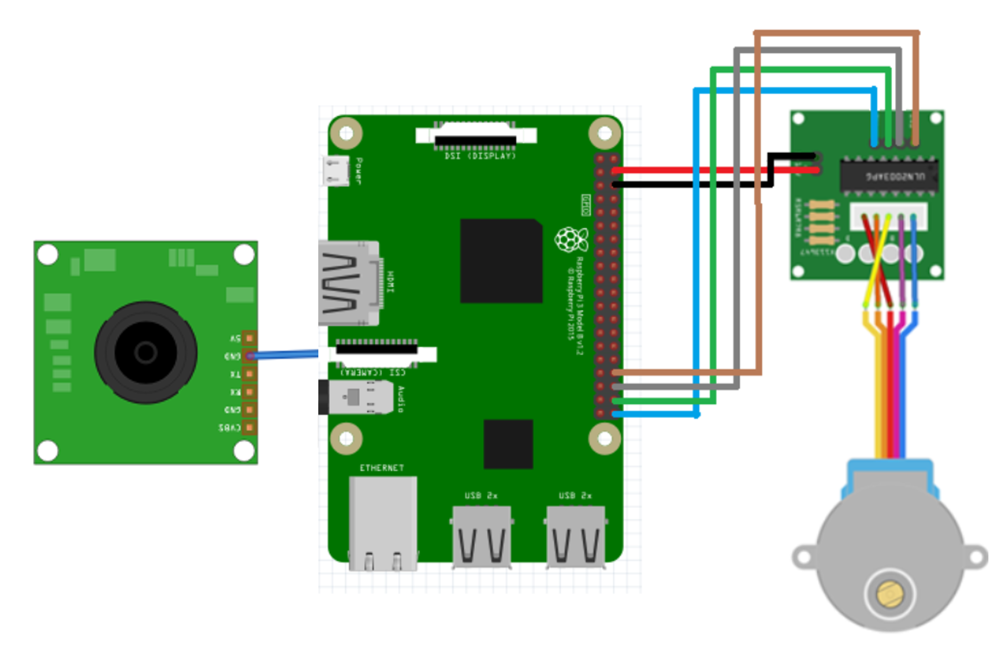

# Mask Detection Access Control
## 인공지능과 라즈베리 파이를 활용한 마스크 착용 인식 출입 통제 시스템
> Wireless Network final exam team project

<br/>

## 🍀 Team

👩🏻‍💻 [박용](https://github.com/dlstk8863) : Software, Project Manager

👨🏻‍💻 [송 휘](https://github.com/songhwee1) : Machine Learning

👨🏻‍💻 [고승우](https://github.com/rhuoo1234) : Raspberry Pi 

<br/>  

## 📃 Overview  
    Raspberry Pi기반의 마스크 착용 인식 출입 통제 시스템
딥러닝을 통해 마스크 착용 및 미착용 모델을 학습시키고, 이를 이용해 웹캠으로 출입하는 사람들의 마스크 착용 여부를 판단하여 마스크 착용시에만 라즈베리파이에 연결된 서보모터가 작동하여 출입문을 열어주는 방식의 시스템입니다.



<br/>

## ✈️ TO BE
시중에서 판매중인 마스크 착용 인식 기기는 100~200만원대의 가격대에 형성되어있습니다. 소규모에 시설에서 사용하기에는 부담있는 가격이기 때문에, 보다 저렴한 가격에 같은 기능을 이용할 수 있도록 하는 것이 목표입니다.


<br/>

## 🔧 Tech

OS :  
```
Raspberi Pi OS
```

BE(Back-End) :
```
Python
```
