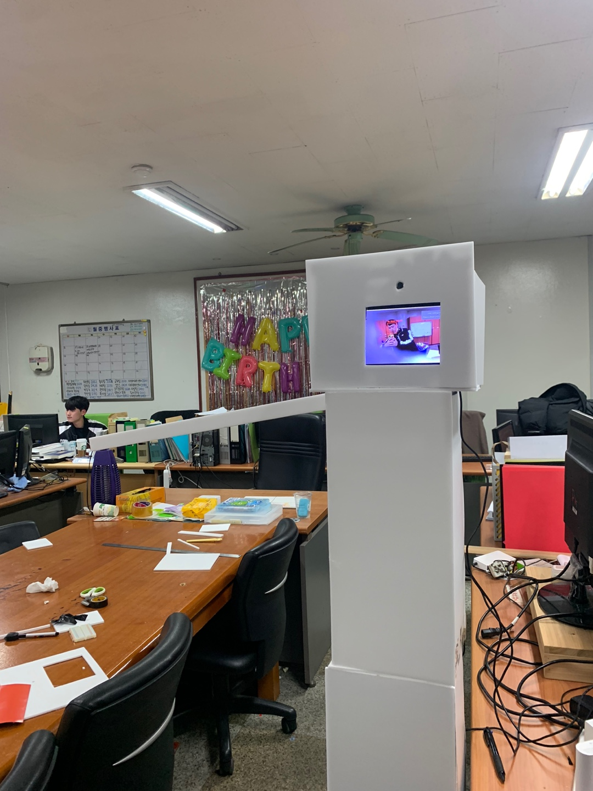

# Mask Detection Access Control
## 인공지능과 라즈베리 파이를 활용한 마스크 착용 인식 출입 통제 시스템
> Wireless Network final exam team project

<br/>

## 🍀 Team

👩🏻‍💻 [박 용](https://github.com/dlstk8863) : Software, Project Manager

👨🏻‍💻 [송 휘](https://github.com/songhwee1) : Machine Learning

👨🏻‍💻 [고승우](https://github.com/rhuoo1234) : Raspberry Pi 

<br/>  

## 📃 Overview  
    Raspberry Pi기반의 마스크 착용 인식 출입 통제 시스템
__딥러닝__ 을 통해 마스크 착용 및 미착용 모델을 학습시키고, 이를 이용해 라즈베리파이 __카메라 모듈__ 로 출입하는 사람들의 마스크 착용 여부를 판단하여 마스크 착용시에만 라즈베리파이에 연결된 __서보모터__ 가 작동하여 출입문을 열어주는 방식의 시스템입니다.

<br/>

## ✈️ TO BE
시중에서 판매중인 마스크 착용 인식 기기는 __100~200만원__ 대의 가격대에 형성되어있습니다. 소규모에 시설에서 사용하기에는 부담있는 가격이기 때문에, 보다 저렴한 가격에 같은 기능을 이용할 수 있도록 하는 것이 목표입니다.

라즈베리파이 모니터 65000원 + 카메라모듈 43000원 + 라즈베리파이4 42000원 + 서보모터 6000원 + 우드락 6000원 = __162000원__

현재 제작한 시제품으로 원가를 __150만원 이상__ 절감하였으며 3D프린터로 본체를 출력하여도 __100만원 이상__ 저렴하게 사용이 가능합니다.

    

<br/>

## ⚙ Deep Learning
1. 얼굴 이미지에 랜드마크를 적용하여 눈썹, 눈, 코, 입 등을 분류해 낸 후 가상의 마스크 이미지를 씌워 제작된 마스크 착용 데이터셋과 마스크 미착용 데이터셋을 이용하였습니다.

2. 연산량과 모델 사이즈를 줄여 빠르게 학습시키기 위해 __MobileNetV2__ 를 이용하여 __CNN__ (합성곱신경망 : Convolution Neural Network) 방식으로 모델을 학습시켰습니다.

3. 학습된 인공지능을 이용하여 이미지 -> 동영상 -> 실시간 영상 순으로 테스트를 진행하였습니다.


<br/>

## 📟 Raspberry Pi
라즈베리파이4 Model B + 5MP OV5647 Mini 카메라 모듈 + 라즈베리파이 공식 7인치 터치스크린 + SG90 서보모터


라즈베리파이의 __5v, Gnd, 18번__ 핀에 서보모터를 연결하였습니다.

## 🔧 Tech

OS :  
```
Raspbery Pi OS
```

BE(Back-End) :
```
Python 3
```
