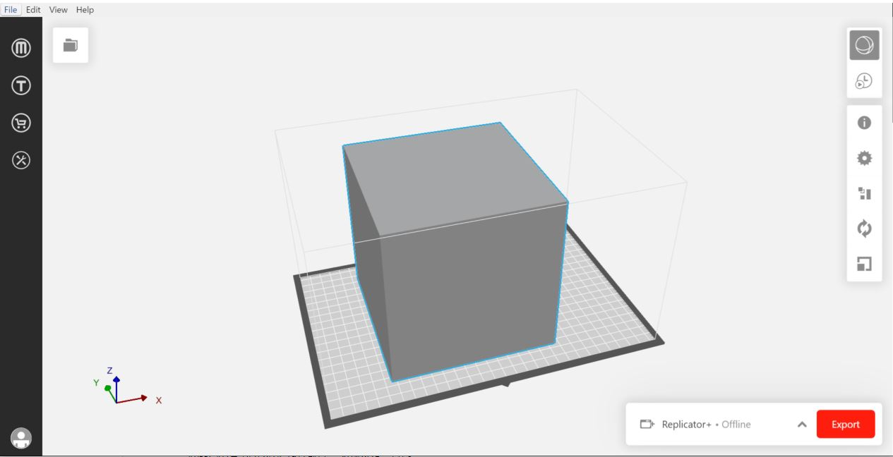

# Mask Detection Access Control
## 인공지능과 라즈베리 파이를 활용한 마스크 착용 인식 출입 통제 시스템
> 시연영상: https://youtu.be/pP1Z1lClY_c

<br/>

## 🍀 Team

👩🏻‍💻 [박 용](https://github.com/dlstk8863) : Software, Project Manager

👨🏻‍💻 [송 휘](https://github.com/songhwee1) : Machine Learning

👨🏻‍💻 [고승우](https://github.com/rhuoo1234) : Raspberry Pi 

<br/>  

## 📃 Overview  
    Raspberry Pi기반의 마스크 착용 인식 출입 통제 시스템
__딥러닝__ 을 통해 마스크 착용 및 미착용 모델을 학습시키고, 이를 이용해 라즈베리파이에 연결된 __카메라 모듈을__ 통해 출입하는 사람들의 __마스크 착용 여부를__ 판단하여 마스크 착용시에만 라즈베리파이에 연결된 __서보모터__ 가 작동하여 출입문을 열어주는 방식의 시스템입니다.

<br/>

## ✈️ TO BE
시중에서 판매중인 마스크 착용 인식 기기는 __100~200만원__ 대의 가격대에 형성되어있습니다. 소규모에 시설에서 사용하기에는 부담있는 가격이기 때문에, 보다 저렴한 가격에 같은 기능을 이용할 수 있도록 하는 것이 목표입니다.

라즈베리파이 모니터 65000원 + 카메라모듈 43000원 + 라즈베리파이4 42000원 + 서보모터 6000원 + 우드락 6000원 = __162000원__

현재 제작한 시제품으로 원가를 __150만원 이상__ 절감하였으며 3D프린터로 케이스를 출력하여도 __130만원 이상__ 저렴하게 사용이 가능합니다.

    

<br/>

## 🔧 Tech

OS :  
```
Raspbery Pi OS
```

BE(Back-End) :
```
Python 3
```

<br/>

## ⚙ Deep Learning
1. 얼굴 이미지에 랜드마크를 적용하여 눈썹, 눈, 코, 입 등을 분류해 낸 후 가상의 마스크 이미지를 씌워 제작된 마스크 착용 데이터셋과 마스크 미착용 데이터셋을 이용하였습니다.

   

2. 연산량과 모델 사이즈를 줄여 빠르게 학습시키기 위해 __MobileNetV2__ 를 이용하여 __CNN(합성곱신경망 : Convolution Neural Network)__ 방식으로 모델을 학습시켰습니다.


3. 학습된 인공지능을 이용하여 이미지 -> 동영상 -> 실시간 영상 순으로 테스트를 진행하였습니다.


<br/>

## 📟 Raspberry Pi
라즈베리파이4 Model B + 5MP OV5647 Mini 카메라 모듈 + 라즈베리파이 공식 7인치 터치스크린 + SG90 서보모터


라즈베리파이의 __5v, Gnd, 18번__ 핀에 __서보모터를__ 연결하였고, __카메라 모듈__ 및 터치스크린의 __모니터 케이블__ 및 __전원을__ 라즈베리파이와 연결하였습니다.

<br/>

## 🖨 3d Printer
AutoCAD를 이용하여 라즈베리파이가 담길 케이스 및 기둥의 3d모델링을 진행하였습니다.

 

 

<br/>

## 🤷‍♂️ How to Use?
1. 라즈베리파이에 모터 및 각종 모듈을 연결합니다.   

2. 라즈베이파이 업데이트를 진행합니다. 
    ```
    sudo apt-get update && sudo apt-get upgrade   
    ```
    
3. 필요한 모듈들을 설치해줍니다.
    ```
    #Tensorflow 설치   
    sudo pip3 install tensorflow   
    
    #Imutils 설치   
    sudo pip3 install imutils   
    
    #OpenCV설치를 위한 의존성 설치   
    sudo apt-get install build-essential cmake git unzip pkg-config    
    sudo apt-get install libjpeg-dev libpng-dev libtiff-dev   
    sudo apt-get install libavcodec-dev libavformat-dev libswscale-dev   
    sudo apt-get install libgtk2.0-dev libcanberra-gtk*   
    sudo apt-get install libxvidcore-dev libx264-dev libgtk-3-dev   
    sudo apt-get install python3-dev python3-numpy   
    sudo apt-get install libtbb2 libtbb-dev libdc1394-22-dev   
    sudo apt-get install libv4l-dev v4l-utils   
    sudo apt-get install libjasper-dev libopenblas-dev libatlas-base-dev   
    sudo apt-get install libblas-dev liblapack-dev gfortran   
    sudo apt-get install gcc-arm*   
    sudo apt-get install protobuf-compiler   
    sudo apt-get install python-dev python-numpy   
    
    #OpenCV 설치
    cd ~
    wget -O opencv.zip https://github.com/opencv/opencv/archive/4.1.2.zip
    wget -O opencv_contrib.zip https://github.com/opencv/opencv_contrib/archive/4.1.2.zip
    unzip opencv.zip
    unzip opencv_contrib.zip
    mv opencv-4.1.2 opencv
    mv opencv_contrib-4.1.2 opencv_contrib
    cd ~/opencv/
    mkdir build
    cd build
    
    #Build하기
    cmake -D CMAKE_BUILD_TYPE=RELEASE \
        -D CMAKE_INSTALL_PREFIX=/usr/local \
        -D OPENCV_EXTRA_MODULES_PATH=~/opencv_contrib/modules \
        -D ENABLE_NEON=ON \
        -D ENABLE_VFPV3=ON \
        -D WITH_OPENMP=ON \
        -D BUILD_TIFF=ON \
        -D WITH_FFMPEG=ON \
        -D WITH_TBB=ON \
        -D BUILD_TBB=ON \
        -D BUILD_TESTS=OFF \
        -D WITH_EIGEN=OFF \
        -D WITH_GSTREAMER=OFF \
        -D WITH_V4L=ON \
        -D WITH_LIBV4L=ON \
        -D WITH_VTK=OFF \
        -D OPENCV_EXTRA_EXE_LINKER_FLAGS=-latomic \
        -D OPENCV_ENABLE_NONFREE=ON \
        -D INSTALL_C_EXAMPLES=OFF \
        -D INSTALL_PYTHON_EXAMPLES=OFF \
        -D BUILD_NEW_PYTHON_SUPPORT=ON \
        -D BUILD_opencv_python3=TRUE \
        -D OPENCV_GENERATE_PKGCONFIG=ON \
        -D BUILD_EXAMPLES=OFF ..
        
    #Build를 위한 메모리 설정
    sudo nano /etc/dphys-swapfile
    Nano text editor진입 후 CONF_SWAPSIZE=100 -> CONF_SWAPSIZE=2048 로 변경
    
    #dphys-swapfile 재시작
    sudo /etc/init.d/dphys-swapfile stop
    sudo /etc/init.d/dphys-swapfile start
    
    #make
    make -j4
    
    #Opencv 설치 마무리
    sudo make install
    sudo ldconfig
    make clean
    sudo apt-get updat
    sudo nano /etc/dphys-swapfile
    #Nano text editor진입 후 CONF_SWAPSIZE=2048 -> CONF_SWAPSIZE=100 로 변경
    sudo reboot
    
4. 본 프로젝트를 라즈베리파이에 clone해줍니다.
    ```
    git clone https://github.com/songhwee1/Wireless_Network.git
    ```
    
5. 마스크 인식 프로그램을 실행시킵니다.
    ```
    cd Wireless_Network
    python3 webcam.py
    ```
<br/>


